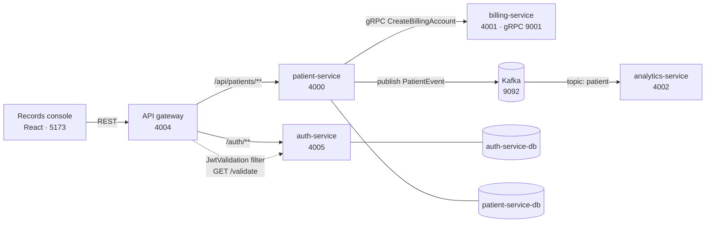

# Patient Management System

Healthcare microservices for patient records, billing, authentication and analytics, talking to each
other over REST, gRPC and Kafka behind a single API gateway — with a React console on the front.

> **Try it:** [phoenixmaster123.github.io/Patient-Management-System](https://phoenixmaster123.github.io/Patient-Management-System/)
> runs the console against an in-memory copy of the seeded registry. No backend, no signup, nothing to
> install — sign in with `testuser@test.com` / `password123`.

---

## Components

| Component | Path | Port | Stores / talks to | Responsibility |
| --- | --- | --- | --- | --- |
| API gateway | `api-gateway/` | 4004 | auth-service, patient-service | Single entry point. Routes and validates the bearer token on every patient call. |
| Auth service | `auth-service/` | 4005 | `auth-service-db` | Issues and validates JWTs. Holds the user table. |
| Patient service | `patient-service/` | 4000 | `patient-service-db`, billing (gRPC), Kafka | Owns the patient registry. On create, opens a billing account and publishes an event. |
| Billing service | `billing-service/` | 4001, gRPC 9001 | — | Opens billing accounts. Business logic is still a stub. |
| Analytics service | `analytics-service/` | 4002 | Kafka | Consumes `PatientEvent` from the `patient` topic. |
| Records console | `frontend/` | 5173 | API gateway | Front-desk UI: roster, patient record, intake. |
| Infrastructure | `infrastructure/` | — | AWS CDK | LocalStack stack definition. |
| Integration tests | `integration-tests/` | — | API gateway | RestAssured tests against a running stack. |

## Ports

| Port | Service |
| --- | --- |
| 4000 | patient-service |
| 4001 | billing-service (HTTP) |
| 4002 | analytics-service |
| 4004 | **api-gateway — the only port you normally call** |
| 4005 | auth-service |
| 5173 | records console (dev server) |
| 5432 | PostgreSQL |
| 9001 | billing-service (gRPC) |
| 9092 | Kafka |

## Prerequisites

- JDK 21
- Docker and Docker Compose
- Node.js 20+ (console only)

Maven is not required — each module ships a wrapper (`./mvnw`).

## Starting everything at once

Two commands: the backend in Docker, then the console.

```bash
docker compose up -d --build
cd frontend && npm install && npm run dev
```

Open <http://localhost:5173>. The first run builds five images and creates both databases, so give it a
few minutes; after that it starts in seconds.

Check it came up:

```bash
docker compose ps
curl -i http://localhost:4004/api/patients   # 401 without a token — that means it is working
```

Stop it, keeping the data:

```bash
docker compose down
```

Add `-v` to drop the database volume and reseed from scratch on the next start.

## Running it on your machine instead

Useful when you want a debugger attached. Start only the infrastructure in Docker, then run the
services yourself:

```bash
docker compose up -d postgres kafka
mvn -DskipTests package
```

Then, each in its own terminal:

```bash
java -jar billing-service/target/billing-service-0.0.1-SNAPSHOT.jar

java -jar auth-service/target/auth-service-0.0.1-SNAPSHOT.jar \
  --jwt.secret=Y2hhVEc3aHJnb0hYTzMyZ2ZqVkpiZ1RkZG93YWxrUKM= \
  --spring.datasource.url=jdbc:postgresql://localhost:5432/auth-service-db \
  --spring.datasource.username=admin_user --spring.datasource.password=password \
  --spring.jpa.hibernate.ddl-auto=update --spring.sql.init.mode=always

java -jar patient-service/target/patient-service-0.0.1-SNAPSHOT.jar \
  --spring.datasource.url=jdbc:postgresql://localhost:5432/patient-service-db \
  --spring.datasource.username=admin_user --spring.datasource.password=password \
  --spring.jpa.hibernate.ddl-auto=update --spring.sql.init.mode=always \
  --spring.kafka.bootstrap-servers=localhost:9092 \
  --billing.service.address=localhost --billing.service.grpc.port=9001

java -jar analytics-service/target/analytics-service-0.0.1-SNAPSHOT.jar \
  --spring.kafka.bootstrap-servers=localhost:9092 --server.port=4002

java -jar api-gateway/target/api-gateway-0.0.1-SNAPSHOT.jar --spring.profiles.active=local
```

The gateway needs `--spring.profiles.active=local`. Its default `application.yml` routes to the compose
hostnames (`http://patient-service:4000`), which do not resolve outside the Docker network;
`application-local.yml` swaps them for `localhost` and supplies `auth.service.url`, which has no default
and without which the gateway will not start.

## Signing in

`auth-service/src/main/resources/data.sql` seeds exactly one user:

```
testuser@test.com / password123
```

`patient-service` seeds 15 patients the same way.

## Configuration

Every value below is a normal Spring property, so it can be passed as `--flag=value` or as the matching
`SCREAMING_SNAKE` environment variable. `docker-compose.yml` sets them all already.

| Property | Used by | Default | Notes |
| --- | --- | --- | --- |
| `jwt.secret` | auth-service | none | Base64 HMAC key. **Required** — the service will not start without it. |
| `auth.service.url` | api-gateway | none | Where the JWT filter calls `/validate`. **Required.** |
| `spring.datasource.url` | auth, patient | none | Each service uses its own database. |
| `spring.datasource.username` / `.password` | auth, patient | none | `admin_user` / `password` in compose. |
| `spring.kafka.bootstrap-servers` | patient, analytics | none | `kafka:29092` inside compose, `localhost:9092` from the host. |
| `billing.service.address` | patient-service | `localhost` | gRPC host of billing-service. |
| `billing.service.grpc.port` | patient-service | `9001` | gRPC port. |
| `server.port` | all | per service | See the ports table. |

The compose file reads `JWT_SECRET` from a `.env` file if you make one; otherwise it falls back to a
throwaway development key. Do not ship that key.

## The console

A React front desk for the registry — sign in, search the roster, open a record, file an intake. It
talks only to the gateway.

```bash
cd frontend
npm install
npm run dev
```

The gateway sends no CORS headers, so the dev server proxies `/auth` and `/api` to it rather than
calling it cross-origin. If the gateway is not running, sign-in offers a demo mode backed by the seeded
data, which is also what the Pages build uses. See [`frontend/README.md`](frontend/README.md).

## API

Everything goes through the gateway on `:4004`.

| Route | Method | Auth | Goes to |
| --- | --- | --- | --- |
| `/auth/login` | POST | none | auth-service — returns `{ "token": "..." }` |
| `/auth/validate` | GET | Bearer | auth-service |
| `/api/patients` | GET, POST | Bearer | patient-service |
| `/api/patients/{id}` | PUT, DELETE | Bearer | patient-service |
| `/api-docs/auth` | GET | none | auth-service OpenAPI |
| `/api-docs/patients` | GET | none | patient-service OpenAPI |

```bash
TOKEN=$(curl -s -X POST http://localhost:4004/auth/login \
  -H 'Content-Type: application/json' \
  -d '{"email":"testuser@test.com","password":"password123"}' | jq -r .token)

curl -s http://localhost:4004/api/patients -H "Authorization: Bearer $TOKEN"
```

Ready-made requests live in `api-requests/` (IntelliJ HTTP client) and `grpc-requests/`.

## Testing

| Suite | Command | Needs a running stack |
| --- | --- | --- |
| Integration (`integration-tests`) | `mvn -pl integration-tests test` | Yes — the gateway on `:4004` |
| Service context tests | `mvn test -pl patient-service` etc. | Yes — Postgres and Kafka |
| Console build | `cd frontend && npm run build` | No |

Both service and integration tests are `@SpringBootTest` / RestAssured style, so they expect real
infrastructure rather than mocks. Start the stack first:

```bash
docker compose up -d --build
mvn -pl integration-tests test
```

This is also why the Docker images build with `-DskipTests`: an image build has no database to talk to.

## Continuous integration

`.github/workflows/ci.yml`, on every push and pull request.

| Job | What it does |
| --- | --- |
| Static analysis | `mvn -N checkstyle:check` and `mvn pmd:aggregate-pmd-check`, uploading both reports |
| Build backend | `mvn -DskipTests package` across all modules, uploads the service jars |
| Build console | `npm ci && npm run build` |
| Stack and integration tests | Brings up the full compose stack and checks it really works, then tears it down |

The backend job compiles the protobuf sources as part of packaging, so a broken `.proto` fails there.

The stack job does not settle for "the containers are up". It asserts, in order:

1. every service logs `Started …Application`, polled until all five do. This is the readiness gate, and
   deliberately **not** the gateway's `401` — a tokenless request is rejected by the gateway's own JWT
   filter before it proxies anywhere, so the gateway answers in seconds while patient-service is still
   booting (~40s). Gating on the 401 races and fails intermittently;
2. every container is still in state `running` — a service can log `Started` and then die, so neither
   check substitutes for the other;
3. the gateway returns `401` without a token, now as an assertion rather than a wait;
4. creating a patient reaches billing over gRPC and analytics over Kafka, matched by patient id in both
   services' logs, which is the only check that proves the wiring rather than the processes;
5. the RestAssured suite in `integration-tests` passes.

## Deployment

`.github/workflows/pages.yml` publishes the console to GitHub Pages on every push to `main` that touches
`frontend/`.

Pages is static, so there is no gateway behind it. The build sets `VITE_DEMO_ONLY=true`, which makes the
console skip the network entirely and run against an in-memory copy of the seeded registry — anyone can
open the link and click through the whole UI, including filing an intake, without installing anything.
Changes live in the browser tab and are gone on refresh.

`VITE_BASE` is set to `/<repo>/` because a project site is not served from the domain root.

To turn it on: **Settings → Pages → Source: GitHub Actions**, then push to `main` or run the workflow
manually.

## Code style

Both analysers keep their configuration in [`checkstyle/`](checkstyle/):

| Tool | Config | Command | Covers |
| --- | --- | --- | --- |
| Checkstyle | `checkstyle/checkstyle.xml` | `mvn -N checkstyle:check` | Formatting, naming, imports |
| PMD | `checkstyle/pmd-ruleset.xml` | `mvn pmd:aggregate-pmd-check` | Dead code, likely bugs, simplification |

The two flags differ, and it is not arbitrary. The root POM aggregates the modules but is **not** their
parent, so neither plugin reaches them by inheritance:

- Checkstyle accepts explicit `sourceDirectories`, so it is aimed at every module from the root and must
  run with `-N` — otherwise Maven recurses and re-checks each module with the wrong base directory.
- PMD skips a `pom` project outright and ignores the equivalent setting, so it needs its aggregate goal
  and the full reactor — hence **no** `-N`.

Neither fails the build today. Checkstyle reports 33 findings (tab characters, star imports, over-long
lines, `log` fields breaking the constant naming rule); PMD reports 1 (an unused local in
`LocalStack.java`). To start failing on regressions, set `severity` to `error` in `checkstyle.xml` and
`failOnViolation` to `true` for PMD in the root POM.

## Architecture



Creating a patient is the one operation that touches three services: `PatientService.createPatient`
writes the row, calls `BillingService.CreateBillingAccount` over gRPC, and publishes a `PatientEvent`
onto the `patient` topic for analytics. The console shows that fan-out on the intake screen.

## Repository layout

```
api-gateway/          Spring Cloud Gateway, JWT validation filter
auth-service/         Login, token issue and validation
patient-service/      Patient CRUD, gRPC client, Kafka producer
billing-service/      gRPC server
analytics-service/    Kafka consumer
frontend/             React records console
infrastructure/       AWS CDK / LocalStack
integration-tests/    RestAssured suite
api-requests/         HTTP client request files
grpc-requests/        gRPC request files
docker/               Postgres init script
docker-compose.yml    Full stack
checkstyle/           Checkstyle and PMD rule sets
pom.xml               Aggregator, so the repo imports as one Maven project
```

## Technologies

Spring Boot 3.4 · Java 21 · Spring Cloud Gateway · PostgreSQL · Apache Kafka · gRPC and Protocol
Buffers · JWT · Docker Compose · AWS CDK with LocalStack · React 18 with Vite · JUnit 5 with RestAssured
· Checkstyle and PMD · GitHub Actions

## License ⚖️

MIT. See [LICENSE](LICENSE).

---
